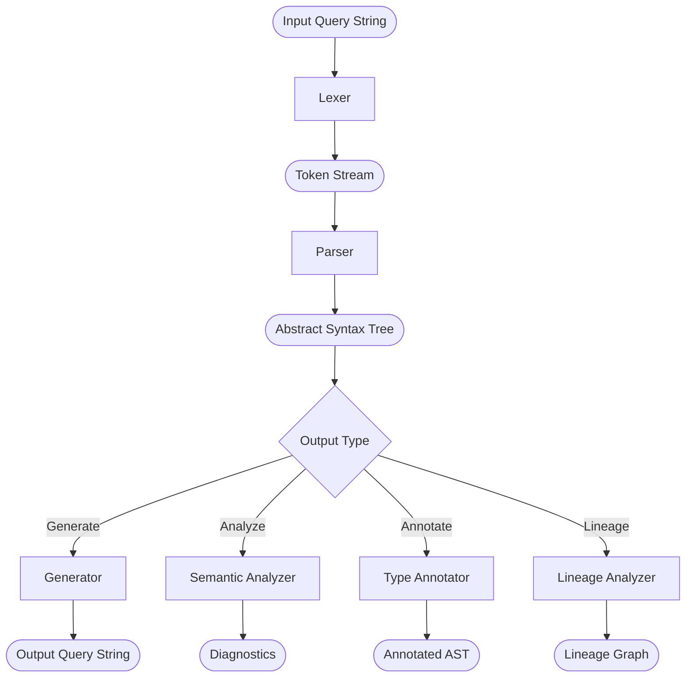

# GraphGlot Architecture

GraphGlot follows a classic compiler pipeline: **Tokenize** → **Parse** → **Analyze** → **Generate**, with additional passes for type inference and lineage tracking.

## Modules

| Module | Location | Purpose |
|--------|----------|---------|
| **Lexer** | `graphglot/lexer/` | Tokenizes query strings using a Trie-based keyword matcher. ~300 token types. |
| **Parser** | `graphglot/parser/` | Recursive descent with backtracking. Parser functions are registered via `@parses` decorator and dispatched by AST type. |
| **AST** | `graphglot/ast/` | ~500 Pydantic expression types generated from the GQL grammar. `Expression` base class provides tree traversal (`dfs`, `bfs`, `find_all`). |
| **Generator** | `graphglot/generator/` | Converts AST back to query strings via `@generates`-registered functions. Composable `Fragment` builder for output. |
| **Dialect** | `graphglot/dialect/` | Pluggable dialect system. Each dialect declares supported features, token overrides, and keyword mappings. `CypherDialect` is the intermediate class for Cypher-based vendors. |
| **Analysis** | `graphglot/analysis/` | `SemanticAnalyzer` runs feature-gated and structural validation rules (scope checking, aggregation rules, type conflicts). |
| **Type Inference** | `graphglot/typing/` | `TypeAnnotator` performs bottom-up type annotation of AST nodes. |
| **Lineage** | `graphglot/lineage/` | Tracks data flow from MATCH patterns to RETURN outputs. Entities: Graph, Pattern, Binding, PropertyRef, OutputField, Filter. Exports to JSON and upstream summaries. |
| **Features** | `graphglot/features.py` | GQL feature definitions (228 optional + extension features). Each feature is a typed constant (e.g., `G002`). |

## Key Design Decisions

- **Registry-based dispatch**: Both parser and generator use decorator-registered function dicts (`PARSERS`, `GENERATORS`) keyed by AST type, enabling dialect-specific overrides without subclassing.
- **Backtracking parser**: `try_parse()` saves token position and restores on failure, enabling the parser to attempt multiple grammar alternatives.
- **Pydantic AST**: All AST nodes are Pydantic models, giving automatic validation, serialization, and `model_copy(deep=True)` for safe transformations.
- **Dialect layering**: GQL core handles ~70% of syntax; `CypherDialect` adds Cypher-specific extensions (arrows, power operator, UNWIND, WITH, etc.) as override parsers/generators.
